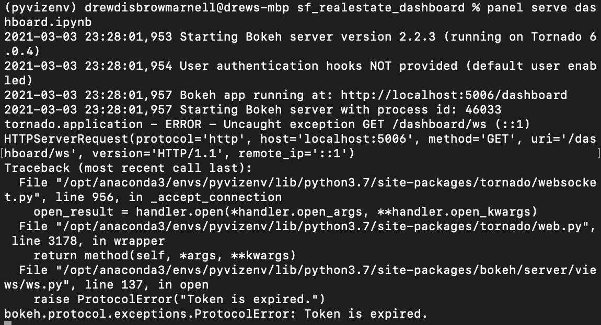
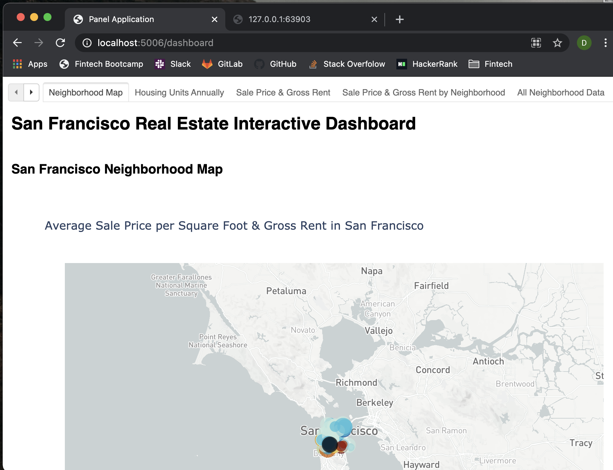

# sf_realestate_dashboard

A dashboard developed to provide charts, maps, and interactive visualizations that help customers explore the data and determine if they want to invest in rental properties in San Francisco.  First data manipulations, calculations and visualizations are formulated in the rental_analysis notebook, then it is copied over to the dashboard notebook and used with Panel to create the final layout and serve on the Internet.

---

## Technologies

Language: Python3, Pandas 

Imports: pandas, panel, os, matplotlib.pyplot, pathlib, dotenv, numpy, warnings, plotly.express, and hvplot.pandas  

External Resources: neighborhoods_coordinates.csv and sfo_neighborhoods_census_data.csv

Developed with JupyterLab

---

## Installation

JupyterLab - [Install JupyterLab](https://jupyterlab.readthedocs.io/en/stable/getting_started/installation.html)

---

## Examples

Using the servable function and the command line to lauch the dashboard as a Panel application.

---

## Contributors

Drew Disbrow Marnell: dldmarnell@gmail.com

---

## License

MIT License
Copyright (c) 2021 Drew Disbrow Marnell
